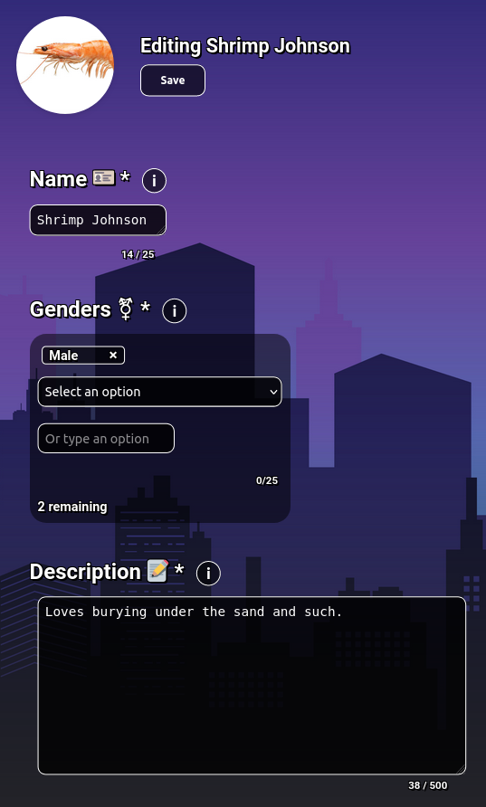
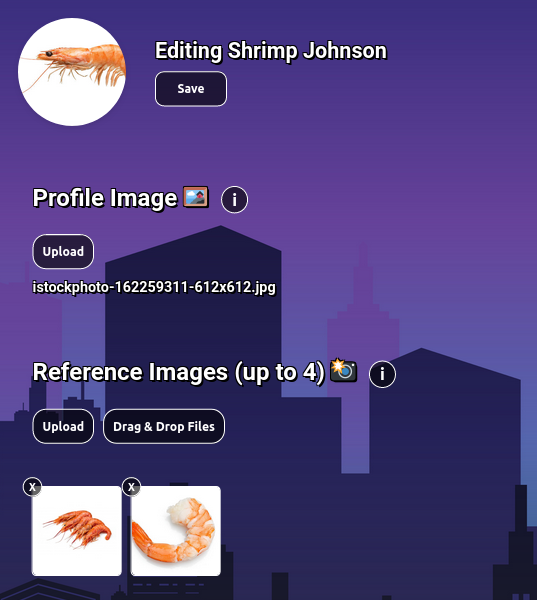
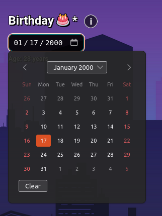
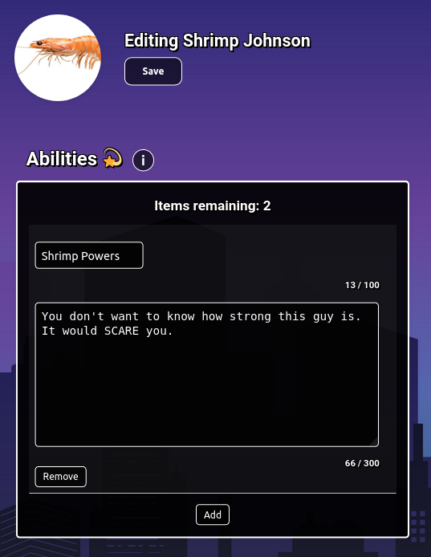
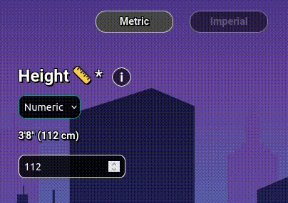
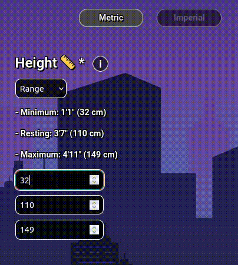
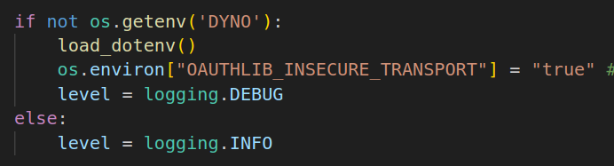

# Discord Character Creator (With Web UI!)

This bot leverages Flask-Discord to provide a character creation UI, connecting to users' Discord accounts through OAuth 2. Users can load, modify, and save character-specific data. The repository also includes a bot for server commands to display character profiles in embedded messages.

Originally created for a D&D server, it's versatile enough for various applications.

## Features and Demonstrations

**Text Areas and Dropdown Menus**

**Profile and Reference Images**

**Date Tracking**

**Dynamic Abilities List**

**Height Settings and Conversions**

## Configurable Elements

### General Settings Parameters
- `info`, `name`, `type`, `optional`, `container`, `placeholder`

### Element-Specific Parameters

**Textarea**
- `mode`, `is_header`, `maxlength`

**Multi-Select**
- `max`, `options`

**File Upload**
- `accept`, `profile`, `multiple`

**Number**
- `measurement`

**Dynamic List**
- `list_type`, `max_items`

**Date**
- Standard parameters apply.

Refer to the `db_settings` folder for JSON configuration examples:
- `form_elements.json`: Form settings for dynamic UI creation.
- `profile_values.json`: Fields for the `/profile` command in Discord bot.
- `submenu_buttons.json`: Submenu buttons configuration.

## How to Run

### Setup
Clone the repository and set up the environment:
- Create a venv from `requirements.txt`.
- Assign `.env` values for Discord bot, Flask app, PostgreSQL database, and Cloudinary image hosting.

### Creating the Database Structure
Run `db_setup.py` with your database link. For help setting up a local PostgreSQL database, refer to [this guide](https://www.prisma.io/dataguide/postgresql/setting-up-a-local-postgresql-database).

After successful script execution, your database is ready.

### Starting the Web Server
With the repository set up and the database ready:
- Run `app.py` and visit `http://127.0.0.1:5000` or the specified local host address.

Note: For production builds, ensure `OAUTHLIB_INSECURE_TRANSPORT` is correctly configured, especially when hosting on platforms other than Heroku.

### Starting the bot
Make sure you invite the bot to your server first and give it the proper send message, read message, etc. permissions as well as the all intents. Also ensure the callback URL is valid, or the invitation process won't go through properly.

Once your bot is in the server:
- Run `char_bot.py`
- Once the bot is online, type `!setup local` in your server
- The commands should proceed to sync.

You should now be able to use `/profile` to load a select menu of your characters, which once selecting one, will load a mini profile. You can also add an additional argument, `/profile @member` to pull up another user's characters.

## Creator's Notes...
Man, I've learned so much during this project. It was my first front-end heavy web application, and it shows, especially in that CSS file.

That poor CSS file...

I definitely learned a lot about the importance of separating scripts, which I did with the Flask/discord.py portions (I was already familiar with both), and eventually the JS. I actually didn't know JavaScript, HTML, OR CSS when I first stated this project, but had learned a lot about the 3 of them through working on it. Still, I'll probably look back and cringe at things I'm doing RIGHT NOW, but that's part of the process.

Does my lack of experience excuse the 1000+ line CSS file? No. But hopefully it gives you a benchmark of where I was at. But yeah, there's a lot of things I want to go back and rework, but it functions fine for its purpose currently. Hopefully some of you can get use out of it as well.
